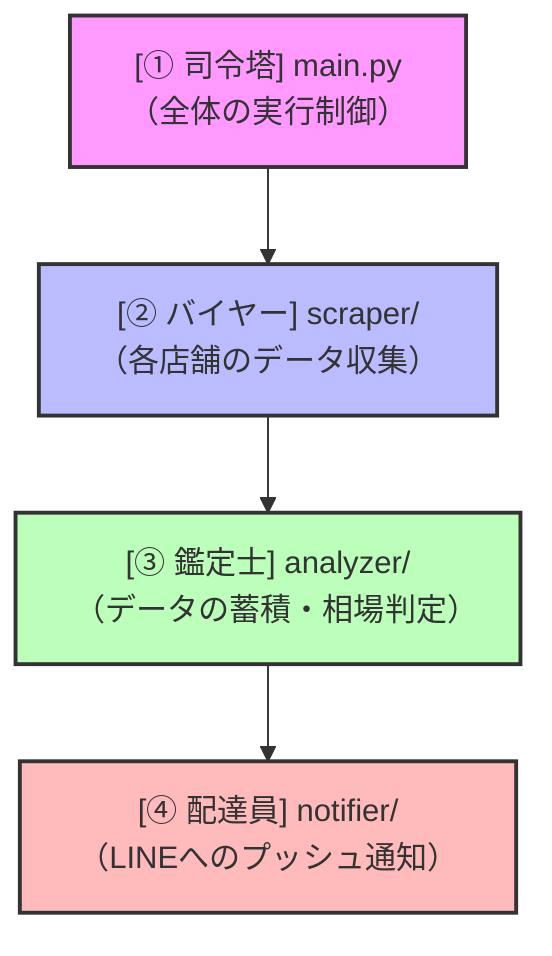

# ScrapeBot: 中古MacBook自律監視・価格相場分析システム

特定の中古ショップから定期的にMacBookのデータを自動収集（スクレイピング）し、蓄積されたデータから算出する独自の「市場平均相場」と比較して本当にお買い得な商品（例: 平均相場より20%以上安いもの）を検知した際に、LINEへリアルタイム通知する自動化システムです。

---

## 💡 開発動機（なぜ作ったのか）

中古のMacBookは非常に人気が高く、スペックが良くて安価な「本当のお買い得商品」は、ショップに出品されてから数分〜数時間で売り切れてしまいます。

しかし、毎日手動で複数のショップ（じゃんぱら、イオシスなど）を何度も巡回して在庫や価格をチェックするのは、膨大な時間と労力がかかります。また、提示されている価格が「本当に相場より安いのか」を瞬時に判断するのは困難です。

この課題を解決するため、**「自動で情報収集し、過去のデータから相場を分析・判定し、お買い得品があればスマホへ即座に通知する」**という一連のプロセスを自動化するシステムをPythonで構築しました。

---

## 🛠️ 技術的なアピールポイント（工夫した点）

1. **スクレイピング先への負荷を抑えるマナー設計**
   * スクレイピング先のサーバーに過度な負荷を与えないよう、アクセス時に適切なスリープ時間（待機時間）を挟むクローラーマナーを徹底しています。
2. **保守性と拡張性の高いモジュール設計（オブジェクト指向）**
   * スクレイピング、データ分析、通知のそれぞれの機能を完全に独立したフォルダ（モジュール）として設計しています。
   * 例えば、「新しいショップも監視対象に加えたい」となった場合、既存のコードを壊すことなく、`scraper/` フォルダの中に新しい店舗用のスクレイパーを追加するだけで簡単に拡張できます。
3. **安全な設定管理**
   * APIトークンなどの個人情報は Git の管理対象から確実に除外し、`config.json.template` という見本ファイルを公開することで、セキュリティ対策と分かりやすさを両立しています。

---

## 🏗️ システムの構造（アーキテクチャ）

このシステムは、それぞれ独立した役割を持つ「4つのモジュール」がきれいに連携して動作しています。



*   **① 司令塔 (`main.py`)**
    *   システム全体を統括し、データ収集、分析、通知の処理を正しい順序でスケジュール実行します。
*   **② バイヤー (`scraper/` フォルダ)**
    *   各ショップ（じゃんぱら、ヤフーショッピング等）のHTMLを解析し、「商品名」「スペック」「価格」「状態ランク」「商品URL」のデータを綺麗に統一された形式で持ち帰ります。
*   **③ 鑑定士 (`analyzer/` フォルダ)**
    *   持ち帰ったデータを蓄積し、同じモデルの「過去の平均価格」を算出します。新着商品の価格がその平均価格より一定割合以上安い場合に「お買い得品（Deal）」として検出します。
*   **④ 配達員 (`notifier/` フォルダ)**
    *   鑑定士が検出したお買い得商品の詳細と商品リンクを、LINEのプッシュ通知を通じてあなたのスマートフォンへ即座に送信します。

---

## 📂 フォルダ構成

```text
ScrapeBot/
├── main.py                    # システムのメイン実行ファイル（司令塔）
├── requirements.txt           # 依存ライブラリ一覧
├── config.json.template       # 設定ファイルのテンプレート（見本）
├── .gitignore                 # Git管理除外設定（秘密キー等を保護）
├── scrapebot_spec.md          # システムの基本設計仕様書
│
├── scraper/                   # スクレイピングモジュール（バイヤー）
│   ├── base_scraper.py        # 各スクレイパーの共通設計図
│   ├── janpara_scraper.py     # じゃんぱら用スクレイパー
│   └── ...
│
├── analyzer/                  # 価格相場の分析モジュール（鑑定士）
│   ├── data_manager.py        # データのファイル保存・読み込み管理
│   ├── price_analyzer.py      # 平均相場などの統計計算
│   └── deal_detector.py       # お買い得商品の判定ロジック
│
└── notifier/                  # 外部通知モジュール（配達員）
    ├── base_notifier.py       # 通知ツールの共通設計図
    └── line_notifier.py       # LINE Notify連携用の通知器
```

---

## 🚀 セットアップと実行手順

### 1. 依存ライブラリのインストール
Pythonがインストールされた環境で、以下のコマンドを実行して必要なライブラリを一括導入します。

```bash
pip install -r requirements.txt
```

### 2. 設定ファイルの準備
1. フォルダ内にある `config.json.template` をコピーし、同じフォルダに `config.json` という名前で保存します。
2. 作成した `config.json` を開き、あなたのLINEの接続情報（トークンなど）を記入します。
   *(※ `config.json` は `.gitignore` に登録されているため、Gitにコミットして公開されることはありませんのでご安心ください)*

```json
{
    "line_channel_access_token": "YOUR_LINE_ACCESS_TOKEN",
    "line_user_id": "YOUR_LINE_USER_ID"
}
```

### 3. システムの起動
以下のコマンド、または付属の `run_scrapebot.bat` をダブルクリックすることで、自動巡回と分析が開始されます。

```bash
python main.py
```
