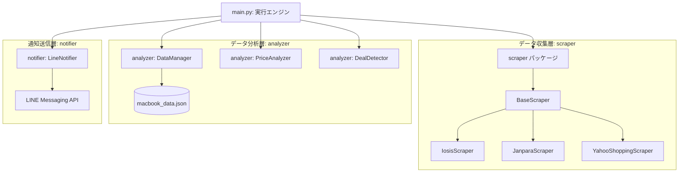
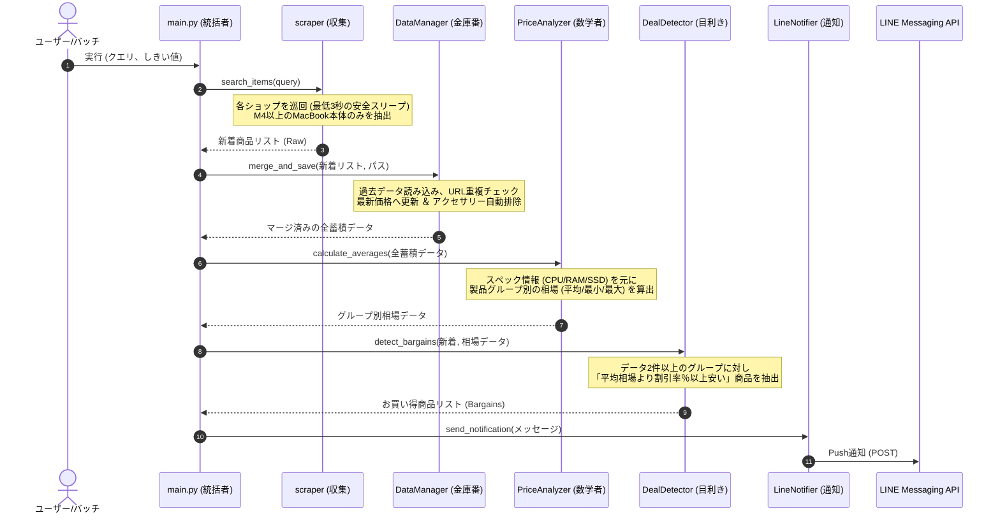

# ScrapeBot システム詳細仕様書 (System Specification)

本書は、中古・総合ECから製品データを自律的に収集・蓄積し、平均相場と比較してお買い得な商品（M4チップ以上のMacBook本体のみを対象）を自動検知してLINEにプッシュ通知するシステム「ScrapeBot」の仕様書です。
AIモデル（Gemini等）が本システムの設計・実装構造・データフローを正確に把握し、機能追加やデバッグを自律的に行える高コンテキストなドキュメントとして記述されています。

---

## 1. システム概要 & アーキテクチャ

ScrapeBotは、オブジェクト指向および単一責任の原則（Single Responsibility Principle）に基づき、以下の5つの専門コンポーネント（モジュール）に分割されて疎結合に設計されています。

### 📌 システム構成図 (Mermaid)



### 📌 処理フロー (データライフサイクル)



---

## 2. ディレクトリ構造

```text
s:\00_Apps\ScrapeBot\
│
├── main.py                     # システムのエントリポイント（統括エンジン）
├── config.json                 # LINE API接続情報（トークン、ユーザーID）
├── config.json.template        # config.json の雛形
├── macbook_data.json           # 重複排除して永続化されたマージ済みのデータベースファイル
├── requirements.txt            # 依存ライブラリ（requests, beautifulsoup4）
├── run_scrapebot.bat           # 定期実行・手動実行用のWindowsバッチスクリプト
│
├── scraper/                    # 【データ収集パッケージ】
│   ├── __init__.py             # パッケージ初期化
│   ├── base_scraper.py         # 共通処理（クレンジング、安全待機、HTTPアクセス）を担う抽象基底クラス
│   ├── iosis_scraper.py        # イオシス用スクレイパー
│   ├── janpara_scraper.py      # じゃんぱら用スクレイパー
│   └── yahoo_shopping_scraper.py # Yahoo!ショッピング用スクレイパー
│
├── analyzer/                   # 【データ分析パッケージ】
│   ├── __init__.py             # パッケージ初期化
│   ├── data_manager.py         # JSONデータの読み込み・お掃除・重複排除マージ保存
│   ├── price_analyzer.py       # スペックごとの平均相場自動計算
│   └── deal_detector.py        # 相場とお買い得判定（お買い得品の検出）
│
└── notifier/                   # 【外部通知パッケージ】
    ├── __init__.py             # パッケージ初期化
    ├── base_notifier.py        # 通知の抽象基底クラス
    └── line_notifier.py        # LINE Messaging APIによるプッシュ通知送信
```

---

## 3. モジュール・クラス詳細

### 3.1 `scraper` パッケージ
WebからHTMLを取得し、データをパースして統一フォーマットにマッピングするレイヤー。

#### ① `BaseScraper` (抽象基底クラス)
*   **役割:** 共通のリクエスト処理、クローリング先サーバーへの負荷軽減（スリープ挿入）、および厳格な「MacBook M4以上本体判定」フィルタの実装。
*   **主要メソッド:**
    *   `_get_page_content(url)`: 指定URLに `requests.get` し、HTMLを返す。安全第一ルールに基づき、アクセス前に `time.sleep(delay)`（デフォルト3秒以上）を強制実行。
    *   `is_macbook_body(name)`: **【超重要フィルタ】**
        *   商品名に「MacBook」を含まない場合 ➔ 除外
        *   「用」「ケース」「充電器」などの周辺機器・アクセサリーキーワードが含まれる場合 ➔ 除外
        *   「Intel」「Core」プロセッサ搭載機 ➔ 除外
        *   正規表現 `\bm([4-9]|\d{2,})` を用いて、**M4以上のApple Silicon搭載モデルのみを通過させる**（M1, M2, M3は古いと判定して除外）。

#### ② 各スクレイパー (`IosisScraper`, `JanparaScraper`, `YahooShoppingScraper`)
*   **共通データフォーマット:** 全てのスクレイパーは、収集したデータを以下のスキーマの辞書リストとして返却します。
```json
{
    "name": "商品名文字列",
    "price": 128000,
    "status": "状態ランク（中古Aランク、未使用品、など）",
    "url": "商品詳細ページの絶対URL",
    "shop_name": "店舗名（イオシス / じゃんぱら / Yahoo!ショッピング）",
    "attributes": {
        "cpu": "Apple M4",
        "memory": "16GB",
        "storage": "512GB"
    }
}
```
*   **スペック抽出ロジック (`_parse_spec_from_title`):**
    各ECサイト特有のタイトル命名規則から、正規表現を用いて `cpu` / `memory` / `storage` を自動抽出します。
    *   *イオシス:* 括弧 `【 】` 内の `Apple M4/16GB/512GB SSD` のようなスラッシュ区切りからパース。
    *   *じゃんぱら:* `商品名 / メモリ / ストレージ` のスラッシュ区切り構造からパース。
    *   *Yahoo!ショッピング:* タイトル全体から `([0-9]+)\s*GB` などを探し、メモリ（4〜128GBの範囲）やストレージ（128GB以上、またはTB単位）を推測してパース。

---

### 3.2 `analyzer` パッケージ
収集されたデータの蓄積、マージ、および相場の計算とお買い得度の算出を担うレイヤー。

#### ① `DataManager`
*   **役割:** データの永続化 (`macbook_data.json`)、重複チェック、および二次クレンジング。
*   **主要メソッド:**
    *   `load_data(filepath)`: JSONからロード。ロード時にも `is_macbook_body` フィルタによる自動クレンジングを行い、ノイズ（アクセサリー類）が混入していれば除外してファイルを自動クリーニングします。
    *   `merge_and_save(new_data, filepath)`: URLを一意なキーとして、過去データとマージ。同じURLの商品が存在する場合は、最新の価格・状態に更新（上書き）します。

#### ② `PriceAnalyzer`
*   **役割:** 蓄積データをもとに、製品スペックグループ別の相場を算出する。
*   **グループキー生成 (`_generate_group_key`):**
    `attributes` 内の `cpu`、`memory`、`storage` を `/` で結合し、一意のスペックキーを作ります。
    *   *例:* `"Apple M4 / 16GB / 512GB"`
    *   ※スペック情報がない場合は、タイトルから簡易的なモデル名・世代を抽出してフォールバックキーとします。
*   **主要メソッド:**
    *   `calculate_averages(data)`: グループごとに登録商品の価格を集計し、平均価格 (`average_price`)、最低価格 (`min_price`)、最高価格 (`max_price`)、データ数 (`count`) を算出します。

#### ③ `DealDetector`
*   **役割:** 相場と新規（あるいは最新）データを突き合わせ、格安品を抽出する。
*   **主要メソッド:**
    *   `detect_bargains(new_items, group_analytics)`:
        *   新着商品の価格と、所属するスペックグループの平均価格 (`average_price`) を比較。
        *   **【信頼性担保】** グループ内のデータ数が**2件以上**ある場合のみ相場比較を行います（データ数1件だと平均価格が自分自身と同じになり、お買い得判定が正常に行えないため）。
        *   割引率 (`(average_price - price) / average_price * 100`) が、設定されたしきい値 `threshold`（デフォルト: 20%）以上安い場合にお買い得商品と判定し、割引率が高い順にソートして返します。

---

### 3.3 `notifier` パッケージ
外部への通知送信を担当するレイヤー。

#### ① `LineNotifier`
*   **役割:** LINE Messaging API の `https://api.line.me/v2/bot/message/push` エンドポイントを叩き、指定された `line_user_id` に対し、お買い得情報をプッシュ通知します（LINE Notifyサービス終了に対応）。
*   **認証情報:** `config.json` に設定された `line_channel_access_token` 和 `line_user_id` を使用。

---

## 4. データスキーマと設定ファイルの構造

### 4.1 `config.json` (接続設定ファイル)
```json
{
    "line_channel_access_token": "YOUR_CHANNEL_ACCESS_TOKEN",
    "line_user_id": "YOUR_USER_ID"
}
```

### 4.2 `macbook_data.json` (データベースファイル)
```json
[
    {
        "name": "Apple MacBook Pro M4 2024 【Apple M4/16GB/512GB SSD】",
        "price": 198000,
        "status": "中古Aランク",
        "url": "https://iosys.co.jp/items/details?id=123456",
        "shop_name": "イオシス",
        "attributes": {
            "cpu": "Apple M4",
            "memory": "16GB",
            "storage": "512GB"
        }
    }
]
```

### 4.3 検出される Bargain オブジェクト (DealDetector出力)
```json
{
    "name": "Apple MacBook Pro M4 2024 【Apple M4/16GB/512GB SSD】",
    "price": 150000,
    "status": "中古Aランク",
    "url": "https://iosys.co.jp/items/details?id=123456",
    "shop_name": "イオシス",
    "attributes": {
        "cpu": "Apple M4",
        "memory": "16GB",
        "storage": "512GB"
    },
    "average_price": 198000,
    "discount_pct": 24.2,
    "group_key": "Apple M4 / 16GB / 512GB"
}
```

---

## 5. 実行方法 & CLIオプション

システムはコマンドラインから実行します。

```bash
# デフォルト実行 (キーワード: MacBook, しきい値: 20%)
python main.py

# カスタム検索 ＆ しきい値設定 (しきい値: 15%以上安いもの)
python main.py "MacBook" --threshold 15

# 安全機能：再スクレイピングを行わず、既存データからの分析・通知のみ実行
python main.py "MacBook" --only-analysis
```
