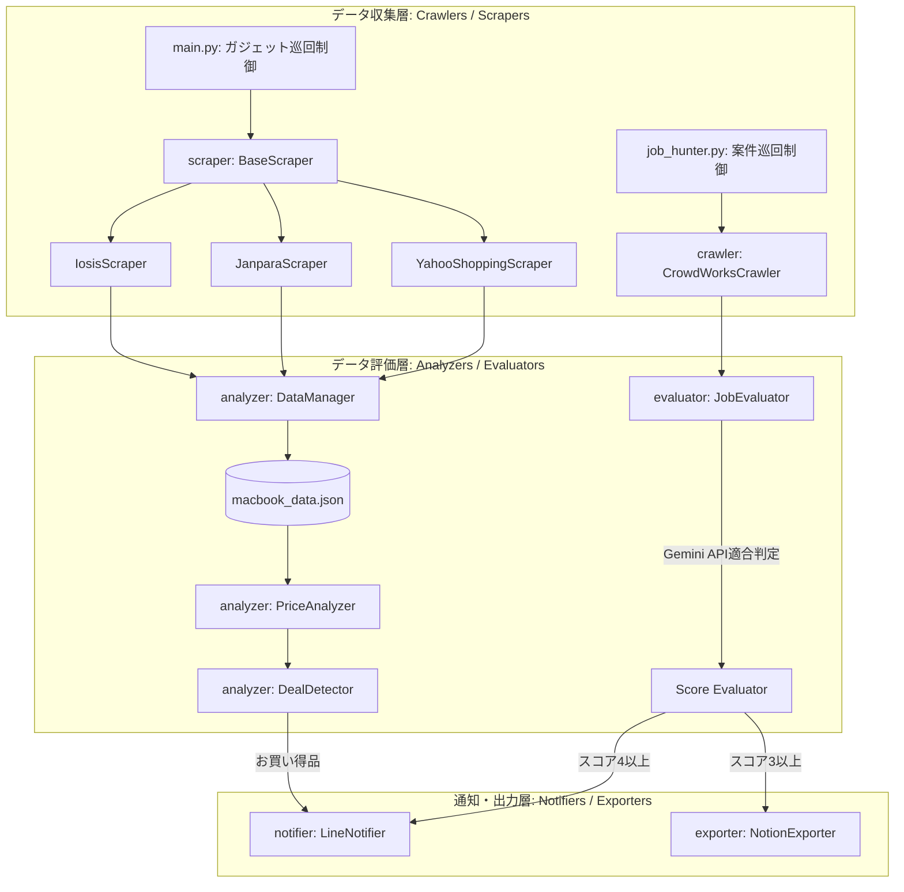

# Snitch システム詳細仕様書 (System Specification)

本書は、多様なチャネルから有用な情報（中古ガジェット相場、仕事案件、トレンド情報等）を自律的に巡回・収集し、AIや統計分析を用いて「価値ある情報」を自動抽出し、LINE通知やNotionにアウトプットする自律型「何でも情報屋」システム「Snitch」の仕様書です。

AIモデル（Gemini等）が本システムの設計・実装構造・データフローを正確に把握し、機能追加やデバッグを自律的に行える高コンテキストなドキュメントとして記述されています。

---

## 1. システム概要 & アーキテクチャ

Snitchは、オブジェクト指向および単一責任の原則（Single Responsibility Principle）に基づき、拡張性と保守性を重視して以下のコンポーネント（モジュール）群に分割されて疎結合に設計されています。

### 📌 システム構成図 (Mermaid)



### 📌 処理フロー (何でも情報屋としての基本シーケンス)

#### A. ガジェット相場監視フロー
1. `main.py` が起動され、各中古ECスクレイパー (`Iosis`, `Janpara`, `YahooShopping`) がターゲット商品（例: MacBook）を安全待機を挟みながら巡回。
2. `DataManager` が過去データと重複排除しながらマージしてJSONへ永続化。
3. `PriceAnalyzer` が同一スペックグループ別の相場価格（平均・最小・最大）を統計算出。
4. `DealDetector` が平均相場より指定％以上割安な掘り出し物を検知。
5. `LineNotifier` がLINE Messaging APIを叩いてお買い得品をプッシュ通知。

#### B. 公開案件監視フロー
1. `job_hunter.py` が起動され、`CrowdWorksCrawler` がPlaywrightを使用して新着の公開案件を収集。
2. `JobEvaluator` が案件情報をGemini APIへ投入し、AIプロンプトを用いて業務内容（バナー制作自動生成フロー等への適合度）を1〜5のスコアで自動判定。
3. `NotionExporter` がスコア3以上の案件をNotionデータベースに自動登録。
4. スコア4以上の合格案件をLINEに即時プッシュ通知。
5. 処理結果の日報サマリーをLINEに送信。

---

## 2. ディレクトリ構造

```text
s:\00_Apps\01_Projects\Snitch\
│
├── main.py                     # ガジェット相場監視のメイン制御エンジン
├── job_hunter.py              # 公開案件監視のメイン制御エンジン
├── config.json                 # LINE API接続情報（トークン、ユーザーID）
├── config.json.template        # config.json のテンプレート
├── .env                        # Notion/Gemini APIキー等の設定環境変数ファイル
├── .env.template               # .env のテンプレート
├── snitch_spec.md              # システム詳細仕様書（本書）
├── README.md                   # 総合取扱説明書
│
├── scraper/                    # 【ガジェットスクレイピング・パッケージ】
│   ├── base_scraper.py         # 共通アクセス・待機処理を定義する抽象基底クラス
│   ├── iosis_scraper.py        # イオシス用スクレイパー
│   └── ...
│
├── crawler/                    # 【Playwright等を用いた多目的クローラー・パッケージ】
│   ├── crowdworks_crawler.py   # クラウドワークス案件収集用クローラー
│   └── ...
│
├── analyzer/                   # 【データ分析・相場統計パッケージ】
│   ├── data_manager.py         # データの重複排除・永続化保存
│   ├── price_analyzer.py       # スペックごとの平均相場自動計算
│   └── deal_detector.py        # 相場基準のお買い得品検出
│
├── evaluator/                  # 【AI/ルールベース評価・目利きパッケージ】
│   ├── job_evaluator.py        # Gemini APIを用いた案件の自動目利き・スコアリング
│   └── ...
│
├── notifier/                   # 【外部通知パッケージ】
│   ├── base_notifier.py        # 通知の抽象基底クラス
│   └── line_notifier.py        # LINE Messaging APIによる通知送信
│
└── exporter/                   # 【外部保存・連携パッケージ】
    ├── notion_exporter.py      # Notionデータベースへのレコード挿入およびLINE仲介
    └── ...
```

---

## 3. 主要データスキーマ

### 3.1 統合データベース (例: `macbook_data.json`)
```json
[
  {
    "name": "Apple MacBook Pro M4 2024 【Apple M4/16GB/512GB SSD】",
    "price": 198000,
    "status": "中古Aランク",
    "url": "https://iosys.co.jp/items/details?id=123456",
    "shop_name": "イオシス",
    "attributes": {
      "cpu": "Apple M4",
      "memory": "16GB",
      "storage": "512GB"
    }
  }
]
```

### 3.2 AI案件判定出力スキーマ (例: `JobEvaluator` からの評価結果)
```json
{
  "score": 4,
  "decision": "合格",
  "reason": "React/Remotionを用いたバナー画像や動画の自動量産ワークフローに極めて適合性が高い案件です。",
  "suitable_skills": ["React", "CSS", "TypeScript"]
}
```

---

## 4. 実行方法 & CLIオプション

システムはバッチファイルまたは直接Pythonから各エントリポイントを実行します。

### A. ガジェット相場監視
```bash
# デフォルト実行 (キーワード: MacBook, しきい値: 10%)
python main.py

# 分析のみを実行 (再スクレイピングを行わない)
python main.py --only-analysis
```

### B. 公開案件監視
```bash
# 通常実行
python job_hunter.py

# テスト実行 (Notion保存・LINE通知を行わずAI判定までを確認)
python job_hunter.py --dry-run
```
